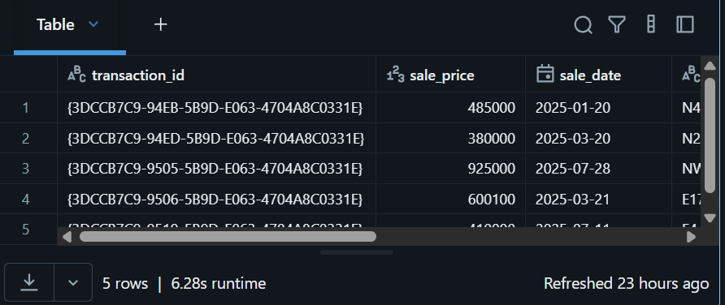
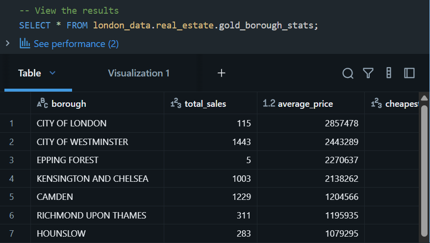
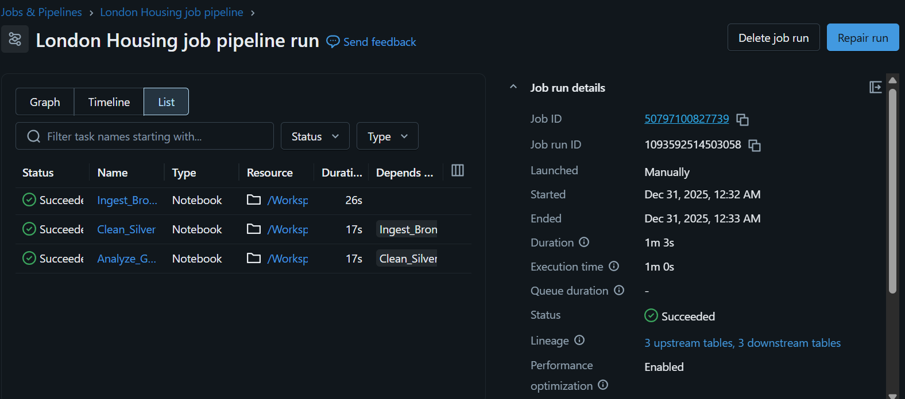

# London Housing Prices – Databricks Project

## Overview
End-to-end data engineering project using **Databricks & PySpark** to process
UK Land Registry housing data for London.

The pipeline follows a **Medallion Architecture**:
- Bronze: Raw ingestion
- Silver: Cleaning & enrichment
- Gold: Aggregated analytics

## Tech Stack
- Databricks
- PySpark
- Delta Lake
- DBFS / Mounted Storage
- GitHub

## Data Source

This project uses public data from the UK government:

- **Dataset:** UK Land Registry – Price Paid Data for the year 2025 
- **Publisher:** HM Land Registry  
- **Coverage:** England & Wales (London subset used)  
- **Link:** https://www.gov.uk/government/statistical-data-sets/price-paid-data-downloads
- **License:** Open Government Licence (OGL)

Contains HM Land Registry data © Crown copyright and database right 2021. This data is licensed under the Open Government Licence v3.0.
The raw dataset is **not included in this repository**.  
Only schemas and transformation logic are provided.

## Pipeline Architecture
CSV → Bronze (Delta) → Silver (Cleaned) → Gold (Aggregated)

## Notebooks
| Notebook | Description |
|--------|------------|
| 01_bronze_ingestion.py | Reads CSV with explicit schema |
| 02_silver_transformation.py | Cleans data & derives date columns |
| 03_gold_aggregation.py | Aggregates avg price & sales count |

## Sample Outputs

### Bronze Table

### Silver Table

### Gold Table

### Job Execution

## Key Features
- Explicit schema definition
- Delta Lake with overwriteSchema handling
- Production-ready joins & transformations
- Enterprise-safe storage paths

## Author
Jagadeesh Jothi Selvaraj
